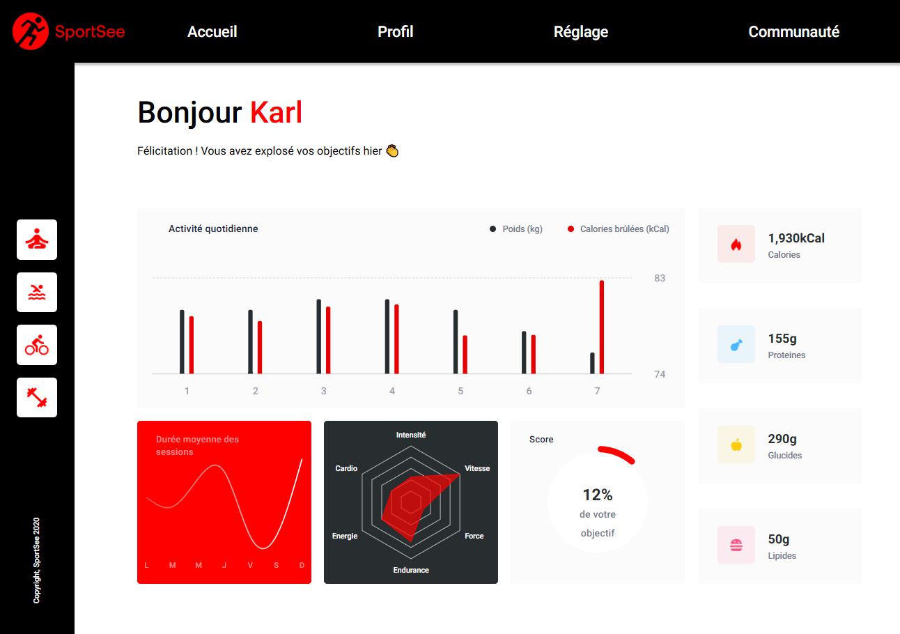

# SportSee - Coaching sportif

---

## Description

SportSee est une application de tableau de bord permettant aux utilisateurs de suivre leurs performances sportives. Ce projet s'inscrit dans le cadre du parcours OpenClassrooms et met en avant l'utilisation de React et de technologies modernes pour la visualisation de données.

## Fonctionnalités 

- Affichage des statistiques personnalisées de l'utilisateur
- Graphiques interactifs pour la visualisation des performances
- Interface utilisateur réactive et moderne

## Prérequis
Les logiciels suivants doivent être installés :
- Node.js
- npm ou yarn pour la gestion des dépendances

## Installation du back-end
- Cloner le dépot Git fourni par OpenClassRooms
- Suivre les instructions du Readme.md :
    - Installer les dépendances: `npm install` ou `yarn`
    - Lancer le back-end: `npm start`
    - Le back-end est accessible à l'URL `http://localhost:3000/`
- URL disponibles :
    - `http://localhost:3000/user/${userId}`: récupère les informations de l'utilisateur
    - `http://localhost:3000/user/${userId}/activity`: récupère les activités de l'utilisateur
    - `http://localhost:3000/user/${userId}/average-sessions`: récupère les durées moyennes des sessions
    - `http://localhost:3000/user/${userId}/performance`: récupère les performances de l'utilisateur

## Installation du front-end
- Cloner ce dépot Git
- Installer les dépendances: `npm install` ou `yarn`
- Lancer le front-end: `npm run dev`
- Le front-end sera accessible à l'URL `http://localhost:5173/`

## Dépendances utilisées
- **react**: ^19.0.0
- **react-dom**: ^19.0.0,
- **react-router**: ^7.4.0
- **react-router-dom**: ^7.4.0
- **recharts**: ^2.15.1
- **sass**: ^1.86.0

Projet développé avec **Vite** ^6.2.0

## Maquette
[Maquette Figma](https://www.figma.com/file/BMomGVZqLZb811mDMShpLu/UI-design-Sportify-FR?node-id=0%3A1)

## Tableau Kanban
[Kanban avec User Stories](https://www.notion.so/openclassrooms/Copy-of-Dev4U-projet-Learn-Home-6686aa4b5f44417881a4884c9af5669e)
